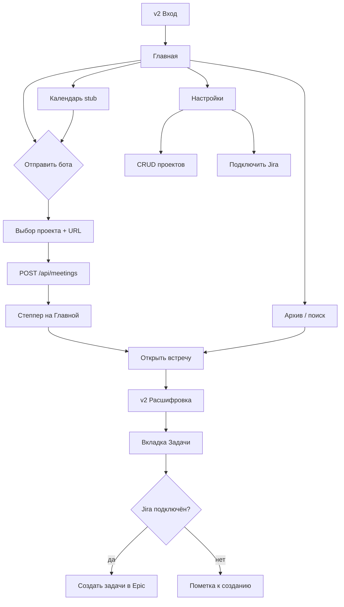

# PM Assistant v2: handoff для внедрения UI и бэкенда

**Дата:** 2026-09-05  
**Аудитория:** агент-архитектор, который разобьёт работу на фронтенд и бэкенд  
**Канон дизайна:** [design-mockup-version-2.pen](designs/design-mockup-version-2.pen) (Style B: фон `#FAF7F2`, акцент `#C86B4A`)  
**Контекст продукта:** [PM_Assistant.md](../PM_Assistant.md), [2026-09-04-fireflies-ux-10-edits.md](2026-09-04-fireflies-ux-10-edits.md)  
**Живой код:** `Projects/PM Assistant/app/`  
**Утверждённая спека (база, с оговорками ниже):** [2026-09-03-pm-assistant-spec.md](2026-09-03-pm-assistant-spec.md)

---

## 1. Цель и границы


### Что меняет v2

Прототип v2 — **следующий целевой интерфейс** после MVP на EC2. Он не отменяет P0-пайплайн (бот по ссылке, STT, ревью LLM, саммари, задачи), но **перестраивает информационную архитектуру** вокруг:

1. **Обязательного входа** (`v2 Вход`) перед любым экраном приложения.
2. **Сущности «проект»** (имя + привязка к трекеру): каждая встреча привязана к проекту; задачи уходят в контекст проекта в **выбранном трекере**, не в глобальную очередь Asana.
3. **Multi-tracker вместо Jira-only** (PO 2026-09-05): picker Asana / Trello / ClickUp / Notion в Настройках; адаптеры; Jira убрать из целевого UI v2. Макет `.pen` ещё с Jira-полями: при внедрении следовать spec, не Jira-only override.
4. **Главной как рабочего стола захвата**: доминирующий блок «Отправить бота», степпер живого звонка, счётчики по проектам, без полосы Asana.
5. **Расшифровки как блокнота**: транскрипт ~60% ширины, **правая колонка без табов** (обзор + задачи в одном скролле), плеер, поиск с подсветкой, поле «Спросить по этой встрече».
6. **Сворачиваемого сайдбара** (256px развёрнут / 64px свёрнут) с липким подвалом (календарь выключен, хранилище, аватар сессии).


### Отношение к живому `app/`


| Область         | Сейчас в коде                                           | Цель v2                                                                         |
| --------------- | ------------------------------------------------------- | ------------------------------------------------------------------------------- |
| Вход            | Нет, Shell открыт всем                                  | Gate на `/login`, сессия в cookie                                               |
| Проекты         | Нет таблицы, нет `project_id` у встреч                  | CRUD в Настройках, picker на Главной                                            |
| Задачи → трекер | `asanaState`, `POST .../asana-queue`, настройки Asana   | `trackerState` + `trackerType`, создание через adapter выбранного трекера       |
| Главная         | Герой «ближайшая встреча», форма справа, «Бот свободен» | Блок ссылки + проект, степпер, проекты, без Asana                               |
| Сайдбар         | Фиксированный, пункт «Интеграции», без аватара          | Сворачивание, без «Интеграции», аватар + Выйти                                  |
| Расшифровка     | 3 равные колонки + слайды, Asana CTA                    | 2 колонки, **без табов**, tracker CTA, плеер                                    |
| Архив           | Фильтры платформа / период                              | Фильтры **проект** / статус, деталь с Epic                                      |
| Календарь       | Локальный список, только «Открыть»                      | Баннер «выключен», CTA по статусу встречи                                       |
| Настройки       | Asana-тоггл, один label проекта                         | Таблица проектов + **глобальная «Сохранить»**, picker трекера, интеграции 50/50 |


### Отношение к спеке 2026-09-03

Спека утверждена с **Asana** (FR-11/12) и без мультипроектности. **Override v2 (обновлено PO 2026-09-05):**

- FR-11/12 и D3 Autopilot → **multi-tracker** (picker + адаптеры); Jira убрать из целевого UI
- Очередь Asana на Главной → **убрана** (решение 2026-09-04)
- Отдельный экран проекта → **не делаем** (решение 2026-09-05).
- Вложенный список встреч в таблице проектов → **не делаем** (только счётчик «Расшифровок»).
- Календарный автоджойн → по-прежнему **вне P0**; в v2 честный режим «выключен», список из SQLite.

Всё остальное из спеки (бот по ссылке, русский STT, саммари, задачи с таймкодом, хранение в БД, режимы записи) **сохраняется**.

### Явные решения прототипа (override до отмены PO)

1. Вход обязателен для закрытия доступа на общем компьютере / EC2-туннеле.
2. Проект задаётся при отправке бота и хранится на встрече.
3. **PO 2026-09-05:** выбор трекера (Asana, Trello, ClickUp, Notion) в Настройках; connect stub per tracker; поля строки проекта задают контекст назначения задач (не Jira-only).
4. Google Календарь: UI статуса и кнопок Подключить / Отключить; **один Google OAuth client** для auth и календаря, если возможно (ADR в `.autopilot/spec.md` §8).
5. Блок «Проекты» на Главной (не отдельный пункт сайдбара); полный CRUD только в Настройках; **commit таблицы через глобальную «Сохранить»**.
6. Маршрут `/integrations` из v1 **убрать** или редиректить на `/settings#integrations`.
7. Расшифровка: **без вкладок** «Обзор»/«Задачи»; единая правая колонка.

---


## 2. Карта экранов

Источник: кадры в [design-mockup-version-2.pen](designs/design-mockup-version-2.pen). Отдельного кадра «экран проекта» **нет**.


| Кадр Pencil      | ID (для MCP) | Маршрут (целевой) | Сайдбар                             | Примечание                  |
| ---------------- | ------------ | ----------------- | ----------------------------------- | --------------------------- |
| `v2 Вход`        | `WcCtE`      | `/login`          | Нет                                 | Вне Shell                   |
| `v2 Главная`     | `MY7XW`      | `/`               | Развёрнут (`Sidebar`, 256px)        | Доминирующий захват         |
| `v2 Расшифровка` | `oggFA`      | `/meetings/:id`   | Свёрнут (`Sidebar Collapsed`, 64px) | Блокнот встречи             |
| `v2 Архив`       | `OuL9Y`      | `/archive`        | Развёрнут                           | Пункт «Расшифровки» активен |
| `v2 Календарь`   | `gsvqb`      | `/calendar`       | Свёрнут                             | Заглушка + список из БД     |
| `v2 Настройки`   | `Uxgjf`      | `/settings`       | Развёрнут                           | Таблица проектов сверху     |


**Переиспользуемые компоненты в** `.pen`**:** `Sidebar` (`XGwhN`), `Sidebar Collapsed` (`Yk8fg`).

**Навигация сайдбара (v2):** Главная · Календарь · Расшифровки · Настройки. Пункта «Интеграции» нет. Пункта «Проекты» в сайдбаре **нет** (подтверждено MCP Pencil 2026-09-05): блок «Проекты» только на Главной, скролл по якорю `#projects` опционален.

---


## 3. Изменения по экранам (было в коде → стало в v2)


### 3.1 `v2 Вход` (`/login`)

**Было:** `App.tsx` сразу рендерит `Shell`, без auth.

**Стало (копирайт из макета):**

- Заголовок «Вход», подпись: «Чтобы закрыть доступ посторонним к расшифровкам на этом компьютере».
- **Первый способ:** кнопка «Войти через Google» (белая, обводка, цветная метка G).
- Разделитель «или».
- **Второй способ:** поле «Почта или локальный аккаунт»; строка «Пароль» с текстовой ссылкой **«Забыли пароль?»** справа (`#C86B4A`); поле пароля; кнопка «Войти» (терракотовая).
- Под кнопкой «Войти»: текстовая ссылка **«Зарегистрироваться»** по центру (`#C86B4A`).
- Подсказка внизу: сессия в браузере после входа; локальный аккаунт или Google.

**Реализация:**

- **Google OAuth 2.0:** `GET /api/auth/google/start` → redirect на Google → `GET /api/auth/google/callback` → создать/найти `users` по `google_sub` + email → Set-Cookie сессии.
- **Локальный вход:** `POST /api/auth/login` с `{ email, password }` (bcrypt hash в БД или env `PM_ASSISTANT_AUTH_`* для single-user).
- Сессия: httpOnly cookie, middleware на все `/api/*` кроме `POST /api/auth/login`, OAuth callback и `GET /api/health`.
- Переменные: `GOOGLE_CLIENT_ID`, `GOOGLE_CLIENT_SECRET` (уже в `.env.example` для Meet). **Решение PO 2026-09-05:** один OAuth client для входа и календаря (ADR `.autopilot/spec.md` §8).
- **Фаза 1.5 (auth scope, после login gate):** ссылки на макете ведут на маршруты `/register` и `/forgot-password` (в прототипе только подпись). Регистрация: `GET /register` + `POST /api/auth/register` или модальное окно поверх `/login`. Восстановление: `GET /forgot-password` + `POST /api/auth/forgot-password` (email с токеном или одноразовый код для single-user). Отдельные кадры в `.pen` не обязательны на фазе 1.

---


### 3.2 `v2 Главная` (`/`)

**Было (**`HomeView.tsx`**):**

- Слева: hero-карточка ближайшей live-встречи + aside «Бот свободен/занят».
- Справа: узкая форма «Запустить запись вручную», список файлов, полоса хранилища в %.
- Нет выбора проекта, нет степпера, нет блока проектов.
- Подзаголовок про «бот готов к записи», не про проекты.

**Стало:**


| Зона              | Содержимое                                                                                                                                                          |
| ----------------- | ------------------------------------------------------------------------------------------------------------------------------------------------------------------- |
| Шапка             | «Главная» + «24 расшифровки в 4 проектах» (динамика) + поиск «Найти встречу или фразу»                                                                              |
| Доминирующий блок | «Отправить бота на звонок»; подпись про ссылку и проект; поле URL; **picker проекта** (чип «Свои»); кнопка «Отправить бота»; чипы платформ; «Распознан Google Meet» |
| Живая полоса      | Название встречи, длительность, платформа; степпер 5 шагов; подпись «Запись: идёт звук»; «Открыть»                                                                  |
| Блок «Проекты»    | Сводка «24 расшифровки в 4 проектах»; карточки проектов: имя, последняя встреча, счётчик, URL Jira, Epic, пояснение про Epic                                        |
| Колонки           | «Следующие по ссылке» (время, платформа, проект, CTA «Отправить бота») · «Последние расшифровки» (сниппет headline, бейдж статуса)                                  |


**Убрать:** hero «следующая встреча как календарь», карточку «Бот свободен», очередь/полосу Asana, облачную квоту в %.

**API:** `POST /api/meetings` принимает `{ url, projectId }`. `GET /api/projects/summary` для блока проектов и подзаголовка.

---


### 3.3 `v2 Расшифровка` (`/meetings/:id`)

**Было (**`MeetingView.tsx`**):**

- Заголовок «Итоги встречи», три равные колонки (транскрипт | резюме | задачи Asana).
- Секция «Слайды» сверху.
- Поиск фильтрует список, без счётчика совпадений и prev/next.
- Нет плеера, нет вкладок, нет чипов спикеров.
- CTA «Отправить N задач в Asana», состояния `asanaState`.

**Стало:**


| Зона        | Содержимое                                                                                                                                                                                  |
| ----------- | ------------------------------------------------------------------------------------------------------------------------------------------------------------------------------------------- |
| Шапка       | Крошка «Главная»; название встречи; чип проекта «Roadmap Q4»; бейдж «Готово»; мета «14 авг · 42 мин · Zoom · Epic ROAD-100»                                                                 |
| Плеер       | `18:24 / 42:10`, скорость `1×`, seek по клику на таймкод                                                                                                                                    |
| Фильтры     | Чипы: Все, Илья, Ника, Сергей, Вопросы, Решения, Задачи                                                                                                                                     |
| Поиск       | Запрос «бюджет Q4», «3 совпадения», prev/next, подсветка в строке, playhead на активной реплике                                                                                             |
| Левая ~60%  | Транскрипт: аватар буквы, имя, таймкод `#C86B4A`, текст                                                                                                                                     |
| Правая ~40% | Панель обзора (headline, решения, риски, шаг, счётчики) и блок **Задачи встречи** в **одной прокручиваемой колонке, без tab UI** (PO 2026-09-05). CTA «Создать N задач» в выбранный трекер. |
| Низ справа  | «Спросить по этой встрече» + подсказки «Какие решения?» / «Что в Epic?»                                                                                                                     |


**Убрать / спрятать:** колонку «Слайды» (P2), третью равную колонку, любые подписи Asana, «+ Новое».

**API:** `GET /api/meetings/:id/audio` (stream/range), `POST /api/meetings/:id/jira-create-tasks`, опционально `POST /api/meetings/:id/ask` (stub OK на первой волне).

---


### 3.4 `v2 Архив` (`/archive`)

**Было (**`ArchiveView.tsx`**):**

- Фильтры: источник (Zoom/Meet/Телемост), период, статус.
- Правая колонка: «Лучшее совпадение», без Epic.

**Стало:**

- Шапка: «Расшифровки», «24 расшифровки в 4 проектах», поиск.
- Чипы: **Все проекты**, Свои, Клиентский прототип, Onboarding, Roadmap Q4; затем статусы Готово / Запись.
- Карточки списка: платформа · длительность · дата · **имя проекта**, сниппет, бейдж.
- Деталь справа: проект, **Epic ROAD-100**, счётчики фрагмент/решения/задачи, «Открыть встречу».

**API:** `GET /api/search` расширить фильтром `projectId`; ответ включать `projectName`, `epicKey`, `snippet` из headline.

---


### 3.5 `v2 Календарь` (`/calendar`)

**Было (**`CalendarView.tsx`**):**

- Баннер «локальный календарь», список встреч, везде «Открыть».

**Стало:**

- Подзаголовок: «Выключен. Бот идёт только по ссылке».
- Баннер: «Живой календарь в этой версии не подключается».
- Строки: время, название, платформа · проект, URL, CTA:
  - идёт запись / готово → «Открыть»;
  - ещё не записано → «Отправить бота».

**API:** тот же `GET /api/meetings`, группировка по `startedAt`; для send — `POST /api/meetings` с `projectId` из встречи.

---


### 3.6 `v2 Настройки` (`/settings`)

**Было (**`SettingsView.tsx`**):**

- Режим записи + блок Asana (тоггл, label) + календари списком + «Сейчас включено».
- Нет таблицы проектов.

**Стало (сверху вниз):**

1. **Таблица проектов** + «Добавить проект» + **глобальная «Сохранить»** (per-row «Отмена» в edit/new OK).
  - Колонки: Проект, контекст трекера (ref), родительский ref (Epic/list и т.п.), Расшифровок, действия.
  - Режимы строки: просмотр | редактирование | новая | подтверждение удаления («Удалить этот проект?»).
2. **Два блока 50/50:** «Режим записи» (3 radio) · «Интеграции».
3. Интеграции:
  - Google Календарь: «не подключён» / подключён; «Подключить Google Календарь» / «Отключить».
  - **Трекер:** picker Asana / Trello / ClickUp / Notion + «Подключить» (stub OAuth).
  - Локальный список встреч: «активен на этом компьютере».

**Сохранить из v1:** секция «Перезапустить бота» (`POST /api/bot/restart`).

**Убрать:** тумблер автоотправки Asana, поле `asanaProjectLabel`.

---


## 4. Каталог компонентов и состояний


### 4.1 Sidebar (`Sidebar` / `Sidebar Collapsed`)


| Состояние   | Ширина | Поведение                                                 |
| ----------- | ------ | --------------------------------------------------------- |
| `expanded`  | 256px  | Подписи пунктов, бренд, кнопка свернуть (иконка «<»)      |
| `collapsed` | 64px   | Только иконки; активный пункт: терракотовая полоска слева |


**Липкий подвал (sticky footer):**

- Рейка **на всю высоту видимой области** (`100vh` / `min-h-screen`), колонка `flex` + `justify-between`: навигация сверху, подвал снизу.
- При скролле **только колонка контента** справа; подвал сайдбара не уезжает вниз вместе с длинным холстом.
- «Календарь выключён» + «В этой версии бот идёт только по ссылке».
- «{N} расшифровок · {M} МБ» + «На этом компьютере, без облачной квоты».
- В свёрнутом виде: компакт «184» (МБ) над аватаром.

**Персистентность:** `localStorage.sidebarCollapsed` или cookie; на `/meetings/:id` и `/calendar` по умолчанию collapsed.

**Файлы:** заменить `app/src/web/shell/Sidebar.tsx`, стили в `shell.css`.

---


### 4.2 Avatar session (подвал сайдбара)


| Состояние   | UI                                                  |
| ----------- | --------------------------------------------------- |
| `expanded`  | Круг «ИВ», «Илья», «этот компьютер», ссылка «Выйти» |
| `collapsed` | Только круг «ИВ»                                    |


Данные из `GET /api/auth/session`: `{ displayName, initials }`. Logout: `POST /api/auth/logout`.

---


### 4.3 Login gate


| Состояние            | UI                                                                                                                    |
| -------------------- | --------------------------------------------------------------------------------------------------------------------- |
| `idle`               | Кнопка «Войти через Google» + разделитель «или» + форма почта/пароль + ссылки «Забыли пароль?» и «Зарегистрироваться» |
| `google_redirecting` | Кнопка Google disabled, «Перенаправление…»                                                                            |
| `submitting`         | Кнопка «Войти» disabled                                                                                               |
| `error`              | Сообщение под формой (неверный пароль / ошибка Google)                                                                |
| `authenticated`      | Redirect на `/`                                                                                                       |


**Поток Google:** клик «Войти через Google» → OAuth → callback → сессия → `/`. Ошибка callback: редирект на `/login?error=google`.

**Вспомогательные ссылки (фаза 1.5):**


| Ссылка на макете     | Маршрут (целевой)  | Примечание                                         |
| -------------------- | ------------------ | -------------------------------------------------- |
| «Забыли пароль?»     | `/forgot-password` | Страница или модал: email → отправка токена/кода   |
| «Зарегистрироваться» | `/register`        | Страница или модал: email + пароль + подтверждение |


На фазе 1 допустимо: ссылки рендерятся, но ведут на заглушку «скоро» или открывают тот же `/login` с query `?view=register`. Полные экраны и API регистрации/сброса: фаза 1.5 в scope auth.

---


### 4.4 Project table rows (Настройки)


| Режим            | UI                                                                                           |
| ---------------- | -------------------------------------------------------------------------------------------- |
| `view`           | Текст ячеек, кнопки «изменить», «удалить»                                                    |
| `edit`           | Инпуты в строке, «Сохранить», «Отмена»                                                       |
| `new`            | Пустая строка внизу, placeholder «Название», `https://.../projects/KEY`, `EPIC-1`, счётчик 0 |
| `delete_confirm` | Inline: «Удалить этот проект?», «Удалить», «Отмена»                                          |


**Правила:**

- Удаление с `meeting_count > 0`: запрет или переназначение (решение: **запрет удаления**, показать ошибку).
- Epic и URL валидировать на непустоту при сохранении.

---


### 4.5 Project picker (Главная, отправка бота)


| Состояние | UI                                       |
| --------- | ---------------------------------------- |
| `closed`  | Чип с именем выбранного проекта («Свои») |
| `open`    | Dropdown списка проектов                 |
| `empty`   | «Создайте проект в Настройках» + ссылка  |


Default: последний использованный `projectId` из `localStorage` или первый в списке.

---


### 4.6 Live-call stepper (5 шагов)

Маппинг **статусов БД** (`MeetingStatus`) на шаги UI (не путать с очередью задач):


| Статус БД      | Шаг UI                | Подпись (пример)                            |
| -------------- | --------------------- | ------------------------------------------- |
| `queued`       | Очередь               | Ссылка принята                              |
| `joining`      | Вход                  | Бот подключается                            |
| `recording`    | Запись                | **Запись: идёт звук** (активный)            |
| `transcribing` | Расшифровка           | Речь в текст                                |
| `summarizing`  | Резюме                | Саммари и задачи                            |
| `ready`        | Все шаги done         | Бейдж «Готово» вместо степпера на детальной |
| `error`        | Шаг с ошибкой + retry | Как сейчас в `MeetingView`                  |


Визуал: горизонтальная лента; прошлые шаги filled, текущий accent, будущие muted.

---


### 4.7 Jira OAuth vs поля таблицы


| Механизм                     | Назначение                                                           |
| ---------------------------- | -------------------------------------------------------------------- |
| Кнопка «Подключить Jira»     | OAuth 2.3 Atlassian → токены в `jira_oauth` / settings               |
| Колонки URL + Epic в таблице | Куда создавать задачи для встреч **этого** проекта                   |
| CTA на встрече               | `POST .../jira-create-tasks` использует OAuth + epic проекта встречи |


UI если OAuth нет: кнопка disabled + «Подключите Jira в Настройках». Задачи всё равно можно помечать «к созданию» локально.

---


### 4.8 Google Calendar connect/disconnect


| Состояние      | UI                                                   |
| -------------- | ---------------------------------------------------- |
| `disconnected` | «не подключён», кнопка «Подключить Google Календарь» |
| `connected`    | email аккаунта (опционально), «Отключить»            |


Первая волна v2: сохранить флаг + stub OAuth (как сейчас «Подключить календарь» без живого flow). Баннеры на Главной/Календаре не обещают автоджойн.

---


### 4.9 Transcript player


| Элемент          | Поведение                                               |
| ---------------- | ------------------------------------------------------- |
| Прогресс         | `current / duration`, seek bar                          |
| Play/pause       | Space / кнопка                                          |
| Таймкод в строке | Seek + подсветка строки `playhead`                      |
| Источник         | `meeting.audioPath` через `GET /api/meetings/:id/audio` |


Если `recordingMode === "text"` и нет файла: плеер скрыт, таймкоды остаются якорями.

---


### 4.10 Search with highlights

**Главная / Архив (topbar):** форма → `/archive?q=...`.

**Расшифровка:**


| Состояние | UI                                            |
| --------- | --------------------------------------------- |
| `empty`   | Placeholder поиска                            |
| `results` | «N совпадений», кнопки prev/next              |
| `active`  | `<mark>` в тексте сегмента, скролл к сегменту |


Реализация: клиентский индекс по `transcript` (первая волна); позже FTS по сегментам.

---


### 4.11 Tabs «Обзор» / «Задачи»


| Вкладка    | Содержимое                                        |
| ---------- | ------------------------------------------------- |
| `overview` | Headline, решения, риски, следующий шаг, счётчики |
| `tasks`    | Список action items, Jira CTA, статусы            |


Состояние вкладки: URL hash `#tasks` или локальный state.

---


### 4.12 Ask-this-meeting field


| Состояние | UI                                   |
| --------- | ------------------------------------ |
| `idle`    | Input + chips-подсказки              |
| `loading` | Spinner в кнопке отправки            |
| `answer`  | Текст ответа над полем (collapsible) |


Первая волна: stub с фиксированными ответами или вызов существующего LLM-адаптера с контекстом встречи. Без брендинга AskFred.

---


## 5. Модель данных и API


### 5.1 Что есть сегодня

**Таблицы (**`schema.ts`**):** `meetings`, `transcript_segments`, `summaries`, `action_items` (`asana_state`), `settings` (key-value), `jobs`, `webhook_deliveries`, `meetings_fts`.

**Типы (**`types.ts`**):** `AsanaState`, `Settings` с `asanaProjectLabel`, `asanaAutoSend`.

**Маршруты:** `GET/POST /api/meetings`, `GET /api/meetings/:id`, `POST .../retry`, `POST .../asana-queue`, `GET/PUT /api/settings`, `GET /api/search`, `POST /api/bot/restart`, public API с Bearer.

**Нет:** users, sessions, projects, `project_id` на встречах, Jira/Google OAuth state.

### 5.2 Предлагаемая схема (миграция SQLite)

```sql
CREATE TABLE projects (
  id TEXT PRIMARY KEY,
  name TEXT NOT NULL,
  jira_project_url TEXT NOT NULL DEFAULT '',
  jira_epic_key TEXT NOT NULL DEFAULT '',
  created_at TEXT NOT NULL,
  updated_at TEXT NOT NULL
);

ALTER TABLE meetings ADD COLUMN project_id TEXT REFERENCES projects(id);

CREATE TABLE users (
  id TEXT PRIMARY KEY,
  email TEXT NOT NULL UNIQUE,
  password_hash TEXT,           -- NULL для учётки только через Google
  google_sub TEXT UNIQUE,       -- sub из Google ID token
  display_name TEXT NOT NULL,
  created_at TEXT NOT NULL
);

CREATE TABLE sessions (
  id TEXT PRIMARY KEY,
  user_id TEXT NOT NULL REFERENCES users(id),
  expires_at TEXT NOT NULL,
  created_at TEXT NOT NULL
);

-- OAuth tokens (зашифрованные или в env для single-user)
CREATE TABLE integration_tokens (
  provider TEXT PRIMARY KEY,  -- 'jira' | 'google_calendar'
  access_token TEXT NOT NULL,
  refresh_token TEXT,
  expires_at TEXT,
  meta_json TEXT NOT NULL DEFAULT '{}'
);
```

`action_items`**:** переименовать/добавить `jira_state TEXT` (`none` | `queued_for_jira` | `created_in_jira`), `jira_issue_key TEXT`. Deprecate `asana_state` после миграции данных.

`settings`**:** удалить ключи `asanaProjectLabel`, `asanaAutoSend` (или игнорировать). Добавить `googleCalendarConnected: boolean` при необходимости.

**Seed:** один user из env при первом запуске; один проект «Свои» если таблица пуста.

### 5.3 Новые и изменённые API


| Метод    | Путь                                      | Назначение                                             |
| -------- | ----------------------------------------- | ------------------------------------------------------ |
| `GET`    | `/api/auth/google/start`                  | Redirect на Google OAuth (scope: openid email profile) |
| `GET`    | `/api/auth/google/callback`               | Обмен code → сессия, redirect `/`                      |
| `POST`   | `/api/auth/login`                         | `{ email, password }` → Set-Cookie                     |
| `POST`   | `/api/auth/logout`                        | Очистка сессии                                         |
| `GET`    | `/api/auth/session`                       | `{ user, integrations: { jira, googleCalendar } }`     |
| `GET`    | `/api/projects`                           | Список проектов + `meetingCount`                       |
| `GET`    | `/api/projects/summary`                   | Для Главной: сводка + последняя встреча по проекту     |
| `POST`   | `/api/projects`                           | Создать                                                |
| `PUT`    | `/api/projects/:id`                       | Обновить имя, URL, Epic                                |
| `DELETE` | `/api/projects/:id`                       | Удалить (409 если есть встречи)                        |
| `POST`   | `/api/meetings`                           | **+** `projectId` **(required)**                       |
| `GET`    | `/api/meetings/:id/audio`                 | Stream audio                                           |
| `POST`   | `/api/meetings/:id/jira-create-tasks`     | Замена `asana-queue`                                   |
| `GET`    | `/api/integrations/jira/start`            | Redirect OAuth                                         |
| `GET`    | `/api/integrations/jira/callback`         | Callback                                               |
| `DELETE` | `/api/integrations/jira`                  | Отключить                                              |
| `GET`    | `/api/integrations/google-calendar/start` | OAuth (волна 2)                                        |
| `DELETE` | `/api/integrations/google-calendar`       | Отключить                                              |


**Middleware:** все маршруты выше кроме `POST /api/auth/login`, `GET /api/auth/google/`*, health, OAuth callback интеграций требуют сессию.

**Поиск:** `GET /api/search?q=&projectId=&status=` → hits с `projectName`, `epicKey`.

### 5.4 Маппинг на существующий код


| Слой         | Файлы для правки                                                                      |
| ------------ | ------------------------------------------------------------------------------------- |
| Схема        | `app/src/db/schema.ts`, `app/src/db/index.ts`                                         |
| Типы         | `app/src/shared/types.ts`                                                             |
| Auth         | новый `app/src/server/routes/auth.ts`, middleware в `app/src/server/app.ts`           |
| Projects     | новый `app/src/server/routes/projects.ts`                                             |
| Meetings     | `app/src/server/routes/meetings.ts` (projectId)                                       |
| Jira adapter | новый `app/src/adapters/jira/` (по образцу `asana/`)                                  |
| Worker       | `pipeline.ts`: `maybeAutoSendAsana` → опционально `maybeAutoSendJira` или убрать авто |
| UI           | все `pages/*`, `shell/*`, `App.tsx` (route guard)                                     |


---


## 6. Потоки пользователя




**Типовой сценарий:**

1. Вход (Google или почта/пароль) → сессия в cookie.
2. Главная → выбрать проект «Свои» → вставить Meet URL → «Отправить бота».
3. Наблюдать степпер (Очередь → … → Запись).
4. «Открыть» → расшифровка: слушать плеер, искать «бюджет Q4», вкладка Задачи.
5. Настройки → добавить проект с URL Jira и Epic → «Подключить Jira».
6. Вернуться на встречу → «Создать 3 задачи Jira».

---


## 7. Критерии приёмки «дизайн = код»

Общие для всех экранов:

- [ ] Style B: фон `#FAF7F2`, акцент `#C86B4A`, без фиолетового Fireflies.
- [ ] Русский UI; без символа U+2014 (длинное тире).
- [ ] Сайдбар: expanded 256px / collapsed 64px; подвал sticky при скролле длинного контента.
- [ ] На collapsed: иконки + аватар «ИВ»; storage compact «{M}» МБ.
- [ ] Нет маршрута «Интеграции» в навигации v2.
- [ ] Нет очереди/полосы Asana на Главной и в Архиве/Календаре.


### `v2 Вход`

- [ ] Кнопка «Войти через Google» сверху, разделитель «или», затем почта/пароль.
- [ ] В строке метки пароля: «Пароль» слева, «Забыли пароль?» справа (текстовая ссылка `#C86B4A`).
- [ ] Под кнопкой «Войти»: «Зарегистрироваться» по центру (текстовая ссылка `#C86B4A`).
- [ ] Копирайт и подсказка про сессию как в макете; без Shell.
- [ ] Google OAuth: start → callback → сессия → `/`.
- [ ] Неавторизованный доступ к `/` редиректит на `/login`.
- [ ] Ссылки `/forgot-password` и `/register`: фаза 1.5 (заглушка или модал допустимы на фазе 1).


### `v2 Главная`

- [ ] Блок «Отправить бота» визуально доминирует (ширина, не боковая колонка).
- [ ] Picker проекта рядом с URL; `POST` с `projectId`.
- [ ] Степпер 5 шагов при live-встрече; нет «Бот свободен».
- [ ] Блок проектов со счётчиками и Jira/Epic на Главной (без пункта «Проекты» в сайдбаре).
- [ ] «Последние расшифровки» со сниппетом headline.
- [ ] Хранилище: «N расшифровок · M МБ на этом компьютере», не «9.2 из 10 ГБ».


### `v2 Расшифровка`

- [ ] Сайдбар collapsed по умолчанию.
- [ ] Крошка «Главная», чип проекта, бейдж статуса.
- [ ] Плеер при наличии audio; таймкоды терракотовые.
- [ ] Поиск: N совпадений, prev/next, подсветка.
- [ ] Правая панель: обзор + задачи (табы с подписями или scroll, не 3 колонки).
- [ ] CTA Jira, не Asana; статусы «к созданию» / «не создана в Jira».
- [ ] Поле «Спросить по этой встрече» внизу справа.
- [ ] Нет «+ Новое», нет секции слайдов в v2.


### `v2 Архив`

- [ ] Чипы проектов первичнее платформы.
- [ ] Карточка показывает имя проекта.
- [ ] Деталь: Epic, не цитата Asana.


### `v2 Календарь`

- [ ] Баннер «выключен»; нет недельной сетки.
- [ ] CTA «Отправить бота» vs «Открыть» по статусу.


### `v2 Настройки`

- [ ] Таблица CRUD в строках; состояния edit/new/delete_confirm.
- [ ] Нет отдельной страницы проекта.
- [ ] Нет вложенного списка встреч в таблице.
- [ ] Два блока 50/50: запись | интеграции.
- [ ] Кнопки Google Calendar и Jira OAuth.
- [ ] «Перезапустить бота» сохранён.


### Responsive

- [ ] `< 1024px`: сайдбар collapsed автоматически; overlay при expand на мобиле (если в scope).
- [ ] Таблица проектов: горизонтальный scroll на узком экране, не ломает layout.

---


## 8. Порядок реализации (фазы для агентов)


### Фаза 0: Подготовка

- Зафиксировать этот handoff как источник правды для v2 UI.
- Визуальные токены Style B в `shell.css` / CSS variables.


### Фаза 1: Auth + Shell

- Таблицы `users` (локальный + `google_sub`), `sessions`; login/logout; **Google OAuth** start/callback; route guard.
- Экран `/login`: кнопка «Войти через Google», разделитель «или», форма почта/пароль.
- Sidebar expanded/collapsed + sticky footer + avatar.
- Убрать `/integrations` из меню.

**Проверка:** без логина не открыть Главную; вход через Google и через пароль создают сессию; аватар и «Выйти» на всех рабочих экранах.

### Фаза 2: Projects schema + API

- Таблица `projects`, `meetings.project_id`, миграция с default-проектом.
- CRUD `/api/projects`, summary для Главной.

**Проверка:** `db.test.ts` + HTTP-тесты create/list/delete.

### Фаза 3: Settings UI

- Таблица проектов, режимы строк.
- Блок интеграций (stub connect/disconnect OK).
- Удалить UI Asana.

**Проверка:** совпадение с кадром `v2 Настройки`.

### Фаза 4: Home UI

- Доминирующий блок + picker + степпер + проекты + последние расшифровки.
- `POST /api/meetings` с `projectId`.

**Проверка:** нет hero-календаря и Asana; степпер совпадает со статусами БД.

### Фаза 5: Meeting UI

- Layout 60/40, вкладки, плеер, поиск, чипы, ask-field.
- `jira_state` вместо `asana_state` в UI (данные могут ещё мигрировать).

**Проверка:** `MeetingView.test.tsx` обновлён под v2.

### Фаза 6: Archive + Calendar

- Фильтры по проекту; деталь с Epic.
- Календарь: баннер + условный CTA.


### Фаза 7: Jira backend

- OAuth flow, adapter, `POST jira-create-tasks`.
- Удалить/deprecate `asana-queue`, `adapters/asana` из UI-пути.


### Фаза 8: Google Calendar (опционально)

- Реальный OAuth или оставить флаг + stub, UI уже готов.


### Фаза 9: Cleanup

- Удалить мёртвый Asana UI, обновить `.env.example`, MCP/docs.
- Регрессия: `npm test`, ручной прогон на EC2.

---


## 9. Вне скоупа / не копировать

**Не делать:**

- Маркетинг Fireflies (Fred, фиолетовый, Share, Skills, Live Assist, CI-метрики).
- Отдельный экран `/projects/:id` и вложенные встречи в таблице Настроек.
- Очередь задач на Главной / в Архиве / в Календаре.
- Автоджойн по календарю в первой волне v2.
- Команда, биллинг, мультипользовательский tenancy.
- Секция «Слайды» и voiceprint в v2 UI (код-заглушки можно оставить в API, не показывать).
- Замена канона `00-all-screens.pen` / `01-home.pen` (исторический артефакт).

**Сознательно отложить:**

- Полноценный RAG-чат «Спросить по встрече» (достаточно stub).
- AI-фильтры «Вопросы / Решения / Задачи» без LLM-классификатора (можно фильтр по спикеру сразу).
- Синхронизация Google Calendar с внешними событиями.

---


## Приложение A: расхождения спека 2026-09-03 vs v2 (для PO)


| Тема         | Спека 2026-09-03                             | Прототип v2                                             |
| ------------ | -------------------------------------------- | ------------------------------------------------------- |
| Трекер задач | Asana FR-11/12                               | **Multi-tracker** (PO 2026-09-05); `.pen` ещё Jira-поля |
| Вход         | Личное использование, без формального логина | Обязательный локальный вход                             |
| Календарь    | Поле ссылки вместо календаря (D2)            | UI подключения Calendar, но live sync позже             |
| Проекты      | Один label Asana                             | Много проектов + picker трекера                         |


Пока владелец не скажет иначе, **при конфликте побеждает spec v2 (approved-with-amendments)** и этот handoff.

---


## Приложение B: ключевые файлы живого кода (точки входа)


| Область          | Путь                                                       |
| ---------------- | ---------------------------------------------------------- |
| Роутинг          | `app/src/web/App.tsx`                                      |
| Shell            | `app/src/web/shell/Shell.tsx`, `Sidebar.tsx`, `TopBar.tsx` |
| Главная          | `app/src/web/pages/home/HomeView.tsx`                      |
| Встреча          | `app/src/web/pages/meeting/MeetingView.tsx`                |
| Архив            | `app/src/web/pages/archive/ArchiveView.tsx`                |
| Календарь        | `app/src/web/pages/calendar/CalendarView.tsx`              |
| Настройки        | `app/src/web/pages/settings/SettingsView.tsx`              |
| API встреч       | `app/src/server/routes/meetings.ts`, `meeting-detail.ts`   |
| Схема            | `app/src/db/schema.ts`, `app/src/shared/types.ts`          |
| Asana (заменить) | `app/src/adapters/asana/`, `POST .../asana-queue`          |


---


## Приложение C: ссылки на решения в Pulse

- 2026-09-04: проекты, Jira Epic, сворачиваемый сайдбар, без Asana на Главной.
- 2026-09-05: вход (локальный + Google OAuth), таблица CRUD, OAuth Jira / Google Calendar, аватар.

Дизайн-правки Fireflies (10 пунктов): [2026-09-04-fireflies-ux-10-edits.md](2026-09-04-fireflies-ux-10-edits.md).

---


## Приложение D: уточнения по MCP Pencil (2026-09-05)

Полный обход `design-mockup-version-2.pen` через MCP Pencil. Детальный каталог: [2026-09-05-v2-ui-elements-changelog.md](2026-09-05-v2-ui-elements-changelog.md). Autopilot: `.autopilot/manifest.md`, `plan.md`, `spec.md`, `tasks.md`.


| Тема        | Уточнение                                                                                                   |
| ----------- | ----------------------------------------------------------------------------------------------------------- |
| Сайдбар nav | Только 4 пункта; «Проекты» убран из навигации                                                               |
| Расшифровка | Ask-поле с примером ответа «Что в Epic?» на кадре                                                           |
| Настройки   | На одном кадре демо всех режимов строки таблицы                                                             |
| Вход        | Ссылки «Забыли пароль?» и «Зарегистрироваться» подтверждены; нижняя подсказка про сессию в слоях не найдена |


